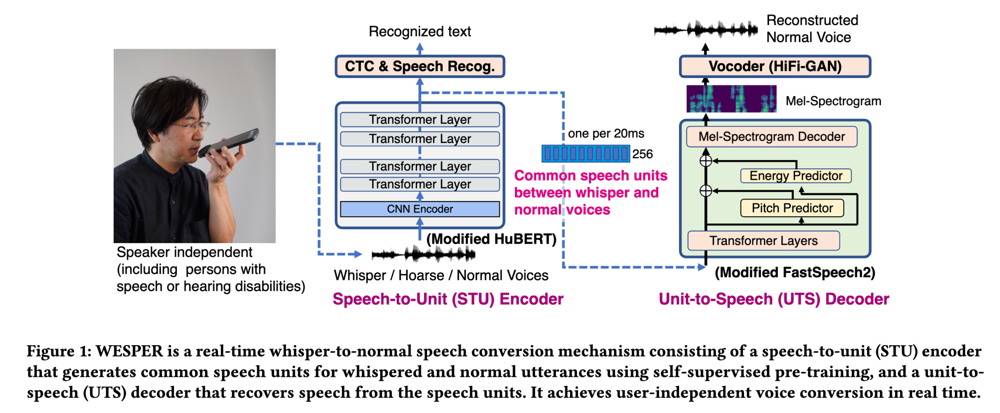
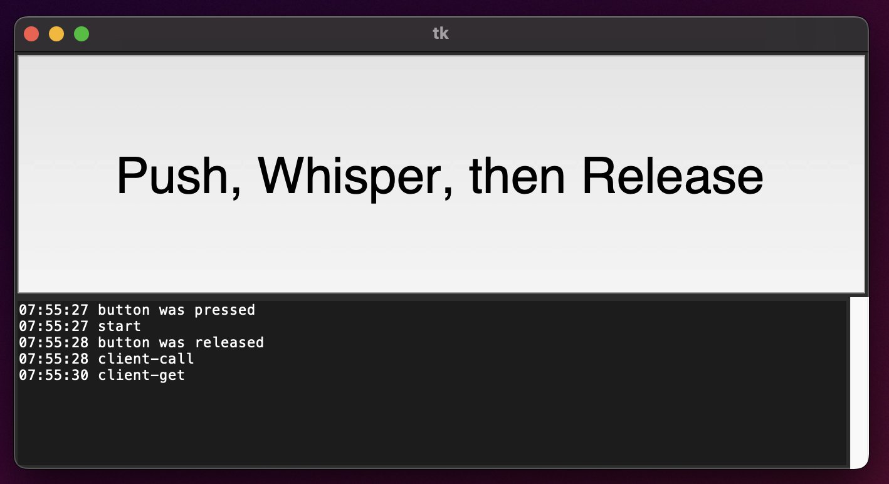

# WESPER: Whisper to Normal Conversion demo
(c) 2022-2023 Jun Rekimoto

Demo code for 

Jun Rekimoto, WESPER: Zero-shot and Realtime Whisper to Normal Voice Conversion for Whisper-based Speech Interactions, ACM CHI 2023

paper: https://dl.acm.org/doi/abs/10.1145/3544548.3580706 <br>
arXiv: https://arxiv.org/abs/2303.01639 <br>
proj: https://lab.rekimoto.org/projects/wesper/ <br>



### Conversion script:
```sh
$ python convert.py --input sample_whisper.wav --output out.wav
```
This script converts audio of sample_wishper.wav and saves it to the out.wav file.

### Converion with GUI:



A server-client type GUI demo is provided where the machine with audio input/output and screen (e.g., laptop) and the conversion machine (supporting CUDA) are separate machines. Currently, the client machine is tested only on macos.

```sh
HOST$ python server.py [--device {cpu,cuda}] [ --hubert HUBERT-MODEL ]  [ --fastspeech2 FASTSPEECH2-MODEL ]  [ --hifigan  HIFIGAN-MODEL ]
CLIENT$ python client.py [--server HOST]
```

HOST should support CUDA. CLIENT can be any mchine that supprot tkiner (without CUDA) and audio input/output.  Two machines shold be able to communicate with ssh.

Connect the CLIENT to the microphone. Audio is recorded only while the 'Record button' is pressed. When the button is released, the voice data is sent to the server (HOST) and the conversion result is played back.

### GUI without a server
Direct mode without using a server:

```sh
mac$ python client_direct.py [ --hubert HUBERT-MODEL ]  [ --fastspeech2 FASTSPEECH2-MODEL ]  [ --hifigan  HIFIGAN-MODEL ]
```
or
```sh
mac$ client_direct.sh # voice trained with LJSpeech
or
mac$ client_direct_googletts.sh # voice trained with GoogleTTS
```

### Software Dependency

Some source codes from the following libraries are used with modification.

HuBERT: https://github.com/bshall/hubert <br>
FastSpeech2 and HiFiGAN: https://github.com/ming024/FastSpeech2 <br>


